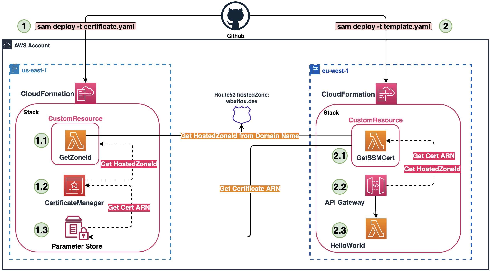

# edge-api-gateway-custom-domain
This code provides a simple stack (API Gateway /hello) to deploy an EDGE-Optimized API Gateway in your preferred region with ACM certificate in us-east-1(mandatory with EDGE API).
You can find the related blog post [here](https://dev.to/wbattou/edge-api-gateway-custom-domain-with-sam-certificate-in-us-east-1-when-using-another-region-2641).

## Prerequisites
Having your Route53 zone in the same AWS account.

## Architecture

## Create the certificate in us-east-1
    $ sam deploy -t certificate.yaml --stack-name cert-sample-api --parameter-overrides "Domain=sample.com" --region us-east-1 --resolve-s3 --capabilities CAPABILITY_IAM --no-fail-on-empty-changeset --no-progressbar

## Create the main stack in your preferred region
    $ sam deploy -t template.yaml --stack-name sample-api --parameter-overrides "Env=Dev Domain=sample.com" --region eu-west-1 --resolve-s3 --capabilities CAPABILITY_NAMED_IAM --no-fail-on-empty-changeset --no-progressbar
